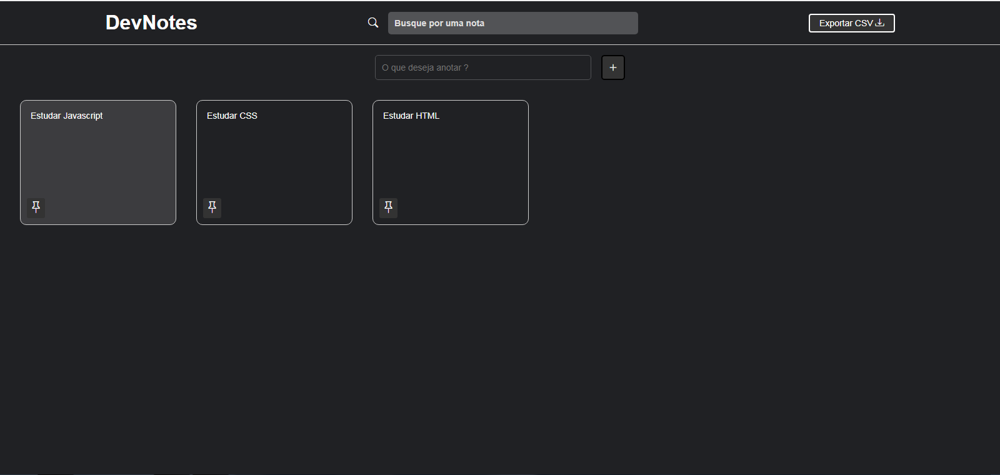

<h1 align="center"> DevNotes </h1>

Programa similar ao Google Keep.  

  <a href="#-tecnologias">Tecnologias</a>&nbsp;&nbsp;&nbsp;|&nbsp;&nbsp;&nbsp;
  <a href="#-projeto">Projeto</a>&nbsp;&nbsp;&nbsp;|&nbsp;&nbsp;&nbsp;
  <a href="#-layout">Layout</a>&nbsp;&nbsp;&nbsp;|&nbsp;&nbsp;&nbsp;

Programa apresentado no canal Hora de Codar - Matheus Battisti

 

  

## 🚀 Tecnologias

Esse projeto foi desenvolvido com as seguintes tecnologias:

- HTML e CSS
- JavaScript
- Git e Github
- Funções indefinidas
- DOM
- Local Storage

## 💻 Projeto

O DevNotes é um organizador de tarefas, onde se é possível adicionar, deletar e fixar lembretes on-line, apresentado no canal Hora de Codar no youtube como aula gratuita. 
Utilizei ste projeto para estudar programação de Javascript, HTML, css, DOM, Funções e Local Storage

## 🔖 Layout

Você pode visualizar o layout do projeto acessando o canal Hora de Codar no youtube

---

Feito com ♥ by Wellington Sato